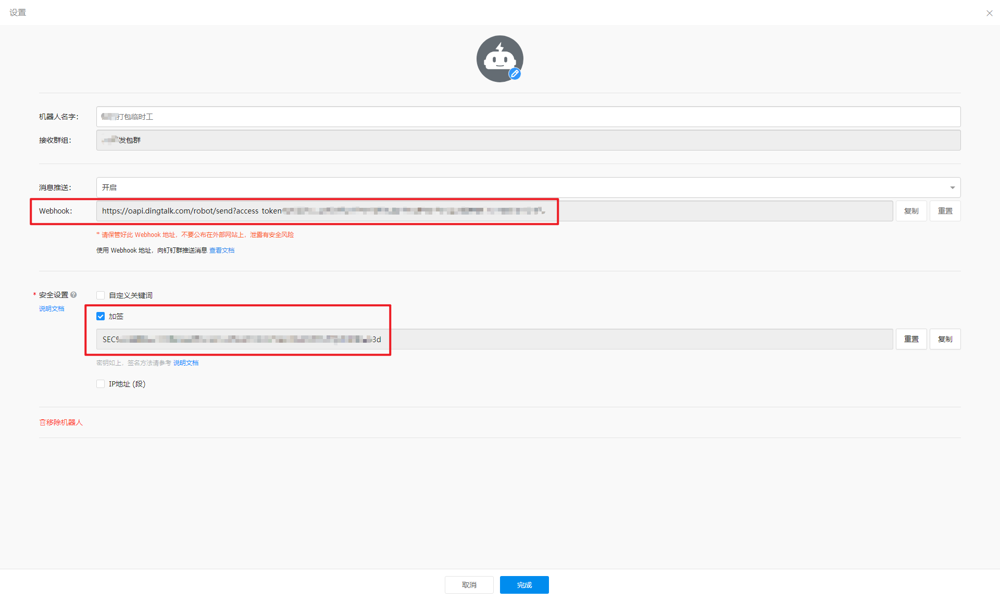
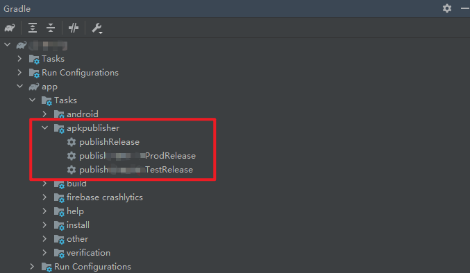
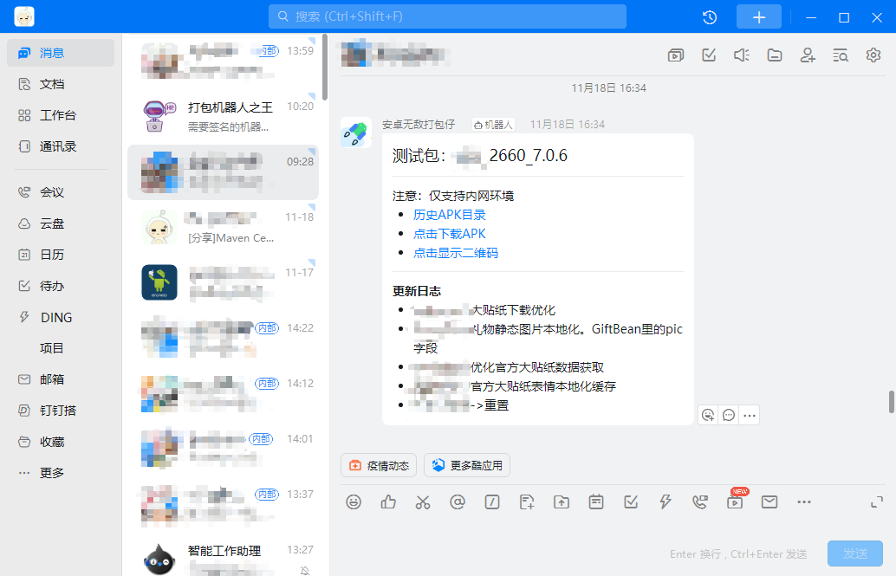

# ApkPublisherGradlePlugin

## 项目简介

该gradle插件项目主要支持功能如下：  

- 创建辅助打包APK的任务
- 发布APK文件到FTP服务器（需自行搭建）
- 生成包含APK下载链接的二维码
- 发送通知消息到钉钉群组

在开发该插件之前，打包、通知等是使用jenkins自动化处理的，但是偶尔会有打包失败的情况，并行打包也存在问题。而且在海外项目组的话打包还需要处理firebase的相关任务，如果服务器上未部署梯子那么打包也会失败。  

所以开发该插件也算是作为一种替补方案了。这里未使用其他例如蒲公英、Firim等三方产品主要也是减少三方审核等类似寄人篱下的麻烦，自己或公司的服务器就完全不用考虑其他各种因素了，而且内网速度也超级快。

## 插件的集成及使用

### 1、创建钉钉机器人

在需要接收消息的钉钉群组中创建“自定义”机器人，然后安全设置中选择加签选项。  
创建好后记住webhook和加签的密钥，下文集成插件的时候会用到。



### 2、集成插件
该插件已发布到MavenCentral仓库，在buildScript中依赖该仓库即可（一般项目创建好后都会默认包含该仓库）：
```
buildscript {
    repositories {
        ......

        // 添加该仓库
        mavenCentral()
    }

    dependencies {
        ......

        // 依赖该插件
        classpath "io.github.vsLoong:apk-publisher-gradle-plugin:1.0.0"
    }
}
```

在项目app目录下的build.gradle使用该插件：
```
plugins {
    ......

    // 使用该插件
    id 'apk-publisher-gradle-plugin'
}

//插件的配置信息
apkPublisherInfo {
    dingTalkServerUrl = "钉钉机器人的Webhook地址"
    dingTalkSecret = "钉钉机器人的签名秘钥"
    dingTalkAtUsers = "需要@人的列表，多个人请用英文逗号隔开，不需要则可以留空或注释掉"

    ftpHost = "FTP地址：例如https://192.168.1.1"
    ftpPort = FTP端口：例如21（注意是int类型）
    ftpUsername = "登录账号"
    ftpPassword = "登录密码"
    ftpBasePath = "FTP指定的文件夹路径"
}
```

### 3、使用插件

集成完插件，Sync Project 后即可在右侧gralde面板中查看到新创建的 **apkpublisher** 任务组。如果项目中未配置flavor，那么只会创建publishRelease的任务。如果项目中配置了多个flavor，那么则会自动创建多个flavor相关的任务，选择需要的任务执行即可：



当选定的任务执行完毕后，若所有插件配置信息正确，则会收到钉钉群组中的消息通知了（注：1.0.0版本暂不支持更新日志的相关配置）：  



若插件配置信息有误，请查看插件输出的日志信息，根据提示进行修正即可。
